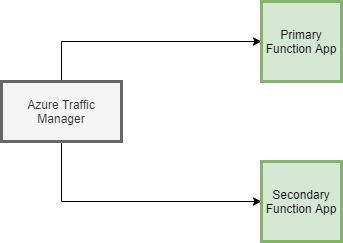

# disaster-recovery-function-app-architecture-linked-arm-template

This arm template seeks to deploy a disaster recovery achitecture following the consupmtion plan of function apps. The architecture to be deployed is as follows:



The function apps contain the following resources:
* storage account
* serverfarm
* Web/site (kind: windows functionapp)
* insight component (for monitoring)

The traffic Manger contains the following resources:
* Traffic Manager

###### note: 
This deployment is incremental

## How it works

Only need to deploy *maindeploy.json* with optional parameters which deploys everything else automatically.

The maindeploy.json is the parent template file that contains linked template deployments:
* **Primary Function Deployment:** This linked template deploys the primary function app using template file *fundeploy.json* and it's parameter file *primarydeploy.parameters.json*

* **Secondary Function Deployment:** This linked template deploys the secondary function app using the template file *fundeploy.json* and it's parameter file *secondarydeploy.parameters.json*

* **Traffic Manager Deployment:** This linked template deploys the traffic manager using the template file *trafficdeploy.json*. it gets it's parameters from *maindeploy.json*. This deploys a traffic manager with 2 endpoints and 'Priority' based routing. These two endpoints are the primary and secondary function apps. These can be manually assigned priorities using parameters given to the parent template file as shown below.

#### Parent template file (maindeploy.json) parameters:
* **RgName1:** Name of the resource group to deploy the primary function app to
  * type: string
  * defaultValaue: rg-primary-app
  
* **RgName2:** Name of the resource group to deploy the secondary function app to
  * type: string
  * defaultValaue: rg-primary-ap
  
* **RgName3:** Name of the resource group to deploy the traffic manager to
  * type: string
  * defaultValaue: rg-primary-ap
  
* **primaryPriority:** Priority to be assigned to the primary function app by the traffic manager
  * type: int
  * defaultValaue: 4
  
* **secondaryPriority:** Priority to be assigned to the secondary function app by the traffic manager
  * type: int
  * defaultValaue: 8
 
 
## Usage

#### Prerequisites
1. Azure Subscription on Azure Portal
2. Powershell
3. Az module
4. maindeploy.json to be downloaded from this repository

#### Steps
1. Sign in to Azure portal through powershell using the command:\
          `Connect-AzAccount`\
This gives a link to an http link and a code. Go to the link and enter the code to sign in.

2. Create the necessary Resource groups you want to deploy the architecture in using:\
     `New-AzResourceGroup -name <name of rg> -location <location of rg>`\
     This will create a resource group with the name given in your subscription\
     ###### Note:
     Create 3 rgs by using this command thrice. One for each app and one for the traffic manager.\
     Make sure **location of the primary app rg should be different than the secondary app rg. (optimally they should be region pairs)**\
     You can check out azure region pairs [here](https://docs.microsoft.com/en-us/azure/best-practices-availability-paired-regions)
     
3. Deploy the architecture using the command:\
     ```
     New-AzResourceGroupDeployment -ResourceGroupName <name of any of the rg you made> -TemplateFile <path to main.deploy.json> `
     -rgName1 <name of rg for primary app> `
     -rgName2 <name of rg for secondary app> `
     -rgName3 <name of rg for traffic manager> `
     -primaryPriority <priority for the primary app> `
     -secondaryPriority <priority for the secondary app>
     ```
    This will deploy the architecture shown above.
